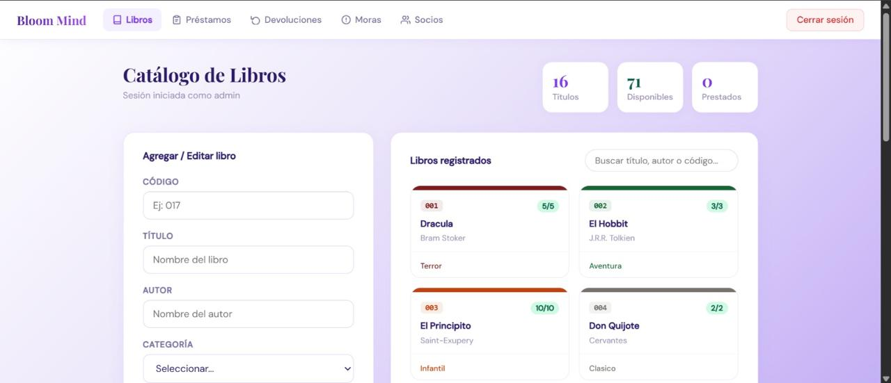

**Sistema de Biblioteca**

**Nombre del proyecto**

Bloom Mind

**Descripción**

Bloom Mind es una aplicación web diseñada para administrar el registro de socios, libros, préstamos, devoluciones y el control de moras de una biblioteca.

**Objetivo**

Facilitar el control y la administración de los recursos de una biblioteca mediante un sistema organizado y eficiente.

**Funcionalidades**

- Inicio de sesión
- Registro de socios
- Registro de libros
- Préstamos de libros
- Devoluciones
- Control de moras
- 
 **Capturas de Pantalla**

**01. Login de Acceso**

**02. Menú Principal**

**03. Gestión de Libros**

 **04. Control de Socios**

**05. Préstamos**

**06. Devoluciones**

**Tecnologías utilizadas**

**Frontend**
- HTML
- CSS
- JavaScript

**Backend**
- Node.js
- JavaScript

**Base de datos**
- PostgreSQL

**Diseño UI/UX**
- Moqups
- Canva

**Instalación**

1.Clonar el repositorio.
2.Configurar la base de datos PostgreSQL.
3.Ejecutar el servidor con el comando: node server.js.
4.Acceder al sistema desde el navegador.

**Integrantes**

- **Líder del proyecto:** Marialis Lantigua
- **Programador Frontend:** Mario Miguel Ruiz
- **Programador Backend:** Julio Elias Marmolejos
- **Diseñadora UI/UX:** Helen Chenoa Pichardo
- **Tester:** Eliana Marmolejos
- **Documentador:** Oscar Sebastian

**Licencia**

Este proyecto fue desarrollado con fines académicos como parte de una práctica universitaria. Su uso es exclusivamente educativo.
